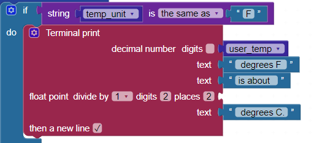

## Learning goals

- Create a simple script in Blockly

- Learn and practice some of the programming basics:

  - Defining a variable

  - if statement for logical comparison

  - Loop

  - Function

  - Boolean comparison

  - Break a for loop

## Software and hardware

- BlocklyProp Solo

- Activity Board

- Parallax USB programming cable

# Programming 1

- Create a script that:

  1.  Gets a number from users. It is assumed the number is a temperature value, and

  2.  Gets the unit of the temperature (either F or C; F for Fahrenheit and C for Celsius).

  3.  Converts the temperature value to the other unit. For example, if users enter a temperature value in F, your code should convert it to Celsius and print it in the terminal.

- Save your code on your computer periodically.

- Submit your code saved as a \*.svg file.

- ***Lab3_YourInitials_DescriptiveName** (e.g., Lab3_AM_temp_convertor)*

# Programming 2

Create a program that checks if the password is correct.

- Define a password (e.g., TAE30!)

- Prompt the user to enter the password

- If the pass is correct, print the pass is correct in the terminal.

- If the pass is not correct, print the pass is incorrect in the terminal and give the user another chance.

- If a user enters the password incorrectly three times, print in the terminal that the account is locked and don't allow to try more!

<!-- -->

- Save your code on your computer periodically.

- Submit your code saved as a \*.svg file.

- ***Lab3_YourInitials_DescriptiveName** (e.g., Lab3_AM_pass)*

<!-- -->

- Submit your codes saved as a \*.svg file.

# Instruction and hints for temperature conversion 

- The script should have two main blocks:

  - **Main block**, in which there are

    - A continuous loop (use *repeat forever* block) asking users to enter

      - A number (use terminal receive block) that represents temperature.

      - A unit for the temperature (either F or C)

    - Call a function that converts the temperature to the other unit.

    - At the beginning of this block, you may want to add a new line (use terminal new line block) and a text block that prompts users to enter a number (use terminal print text block).

    - Add a block to pause for 3 seconds (use pause (ms) block).

  - **Your function block**, which

    - Converts the temperature to the other unit depending on what the users entered. You may want to use if...else... statement.

    - Prints the outcome in the terminal (e.g., "72 degrees F is about 22.22 C.").

HINTS:

- To convert F to C, you can use the following equation:

**Temp_in_C = (temp_in_F -- 32) x 5/9**

- You can derive another equation to convert C to F.

- Please make sure to use parenthesis to do the calculations in the proper order.

- BlocklyProp uses integer numbers. The** floating point number** option allows an integer value to be displayed as a decimal number. Since you may get float numbers after calculation, you may want to use terminal print with float print in which you can define the number of digits (before the decimal) and the number of places (after the decimal).

  - As an example, please watch this video: <https://youtu.be/iIXOUj8WMWo>

  - Here is an example of how you can create it:

# Instruction and hints for password evaluator 

- The script should have two main blocks:

  - **Main block**, in which there are

    - A statement for setting a password (e.g., my_pass = "TAE30!) and other required statements

    - Call a function that evaluates the password.

    - Comments as needed.

  - **Your function block**, which

    - Prmopts users to enter a password.

    - Evaluates if the entered password is correct by comparing it to the set password ("TAE30!").

    - Prints an apporipirte statement in the terminal accordingly.

HINTS:

- Password evaluation can be done in a for loop (repeat) for three times.

- If the password is correct, we should exit the loop, as there is no need for another attempt.

- If the password is incorrect, print an appropriate statement in the terminal and prompt the user to enter a new password (another attempt).

- You should keep track of the number of attempts. If the number of attempts reaches the defined threshold (e.g., 3), print a statement in the terminal and stop the process (users are not allowed to enter a new password).

- To keep track of the number of attempts, you can increment a variable that is pre-defined to zero before entering the for loop. Each time the user enters a password, the pre-defined variable is incremented by one until it becomes equal to the threshold (e.g., 3).

**Useful resources**

Propeller BlocklyProp Block Reference

<https://learn.parallax.com/support/reference/propeller-blocklyprop-block-reference>

- [**Variable Blocks**](https://learn.parallax.com/tutorials/language/blocklyprop/simple-blocklyprop-programs-propeller-boards/variable-blocks)

- [**Terminal Talk**](https://learn.parallax.com/tutorials/language/blocklyprop/simple-blocklyprop-programs-propeller-boards/terminal-talk)

- [**Values and Math Blocks**](https://learn.parallax.com/tutorials/language/blocklyprop/simple-blocklyprop-programs-propeller-boards/values-and-math-blocks)

- [**Making Decisions**](https://learn.parallax.com/tutorials/language/blocklyprop/simple-blocklyprop-programs-propeller-boards/making-decisions)

- [**Blocks that Repeat**](https://learn.parallax.com/tutorials/language/blocklyprop/simple-blocklyprop-programs-propeller-boards/blocks-repeat)

- [**Functions**](https://learn.parallax.com/support/reference/propeller-blocklyprop-block-reference/functions)
