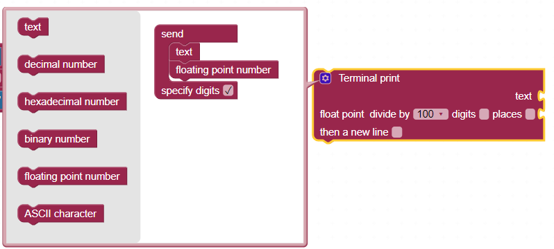

## Learning goals

- Create a script in Blockly.

- Learn and practice some of the programming basics:

  - Measure temperature using temp/RH sensor

  - Measure relative humidity percentage using temp/RH sensor

## Software and Hardware

- BlocklyProp Solo

- Activity Board and Parallax USB programming cable

- Temperature & Humidity Sensor

# Programming 1

- Create a script that:

  1.  Gets a number from users. It is assumed the number is a temperature value, and

  2.  Gets the unit of the temperature (either F or C; F for Fahrenheit and C for Celsius).

  3.  Converts the temperature value to the other unit. For example, if users enter a temperature value in F, your code should convert it to Celsius and print it in the terminal.

- Save your code on your computer periodically.

- Submit your code saved as a \*.svg file.

- ***Lab4_YourInitials_DescriptiveName** (e.g., Lab4_AM_temp_convertor)*

# 

# Programming 2

- Create a script that:

  1.  Reads temperature sensor data in Fahrenheit and assigns it to a variable (e.g., temp_F); please note that the sensor is connected to pin 14.

  2.  Reads RH in percentage and assigns it to a variable (e.g., rh),

  3.  Prints temperature in F and C in the terminal (you may use the code you wrote for the previous assignment). For example:

> Temp: 72 F
>
> Temp: 22.22 C

4.  Prints RH in the terminal with its unit (e.g., RH = 50 %).

5.  Makes decisions based on the temperature:

    i.  If temp_F \> 70

> Then print("Turn on AC")
>
> Turn on the built-in LED light connected to P26; otherwise, turn it off.

ii. If temp_f ≤ 70

> Then print("Turn on the heater")
>
> Turn on the built-in LED light connected to P27; otherwise, turn it off.

- Please note that we selected this threshold to ensure that one of the conditions is always true. If it is, it will print something in the terminal, and one of the LEDs will turn on.

<!-- -->

- Save your code on your computer periodically.

- Submit your code saved as a \*.svg file.

> ***Lab4_YourInitials_DescriptiveName** (e.g., Lab4_AM_temp_rh_measurements)*

- Submit your codes saved as a \*.svg file.

# Instructions and hints for temperature conversion 

- The script should have two main blocks:

  - **Main block**, in which there are

    - A continuous loop (use *repeat forever* block) asking users to enter

      - A number (use terminal receive block) that represents temperature.

      - A unit for the temperature (either F or C)

    - Call a function that converts the temperature to the other unit.

    - At the beginning of this block, you may want to add a new line (use terminal new line block) and a text block that prompts users to enter a number (use terminal print text block).

    - Add a block to pause for 3 seconds (use pause (ms) block).

  - **Your function block**, which

    - Converts the temperature to the other unit depending on what the users entered. You may want to use if...else... statement.

    - Prints the outcome in the terminal (e.g., "72 degrees F is about 22.22 C.").

HINTS:

- To convert F to C, you can use the following equation:

**Temp_in_C = (temp_F/10 -- 32) x 5/9**

NOTE: you should first divide the sensor reading by 10.

- BlocklyProp uses integer numbers. The** floating point number** option allows an integer value to be displayed as a decimal number. Since you may get float numbers after calculation, you may want to use a terminal print with float print in which you can define the number of digits (before the decimal) and the number of places (after the decimal).

  - As an example, please watch this video: <https://youtu.be/iIXOUj8WMWo>

  - Here is an example of how you can create it:

# 

# Instructions and hints for reading sensor data

- The script should have two main blocks:

  - **Main block**

    - At the beginning of this block (before the loop), you may want to define a pre-defined variable called *k* with a value of 1 (k = 1).

      - Then, print in the terminal:

> "Reading #" k
>
> In the first iteration, it will print Reading \# 1

- Increment k at the end of the loop (k = k + 1) or after the print statement. In this case, k will be updated at each iteration. So, in the second iteration, it will print Reading \# 2

- A continuous loop (use *repeat forever* block) to read the sensor data

  - Please note that the sensor is connected to **pin 14**.

  - Please clear the screen (use *Terminal clear screen* block)

- Call a function that converts the temperature to Celsius.

- Print the sensor data

  - Print the reading number

  - Print temperature in F

  - Print temperature in C

  - Print RH in percentage

    - Please note that the RH read by the sensor is 10 times more than the actual RH, so you should divide it by 10.

- Print the outcome of the defined conditions (either turning on the AC or heater).

- Turn on one of the built-in LEDs based on the abovementioned conditions. If the condition is not true anymore, you should turn the LED off.

- Add a block to pause for 3 seconds (use pause (ms) block).

- After that, the terminal is deleted, and the new readings will be displayed.

<!-- -->

- **Your function block**, which

  - Converts the temperature from F to C.

  - Please note that the temperature read by the sensor is 10 times the actual temperature. So you need to first divide it by 10 and then put it in the equation for the conversion.

**Useful resources**

Propeller BlocklyProp Block Reference

<https://learn.parallax.com/support/reference/propeller-blocklyprop-block-reference>

- [Temp and RH sensor](https://learn.parallax.com/support/reference/propeller-blocklyprop-block-reference/sensor/temp-humidity)

- [Temperature & Humidity Sensor Wiring & Example Code](https://learn.parallax.com/support/reference/propeller-blocklyprop-block-reference/sensor/temp-humidity/temperature-humidity)

- [Make LED light on/off](https://learn.parallax.com/tutorials/language/blocklyprop/blink-light)
